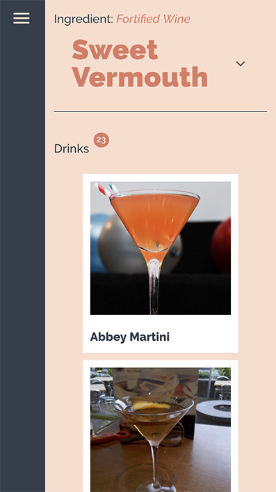

# Drinkz

Drinkz is a simple web tool to help to find different alcoholic and non alcoholic drink recipes. You just need to enter a drink name (or part of the name) or to choose a drink ingredient from the list.

## Live Demo

https://pure-meadow-16203.herokuapp.com/

## Getting Started

1. Install dependencies (using the npm install command).
2. Run the web server by using the npm run dev.
3. Connect to the server through localhost:3000.

## Dependencies

"axios": "^0.19.0",
"concurrently": "^4.1.1",
"cors": "^2.8.5",
"express": "^4.17.1",
"express-graphql": "^0.9.0",
"graphql": "^14.4.2"
"@apollo/react-hooks": "^3.0.0",
"@emotion/core": "^10.0.16",
"@material-ui/core": "^4.3.2",
"@material-ui/icons": "^4.2.1",
"apollo-boost": "^0.4.4",
"node-sass": "^4.12.0",
"prop-types": "^15.7.2",
"react": "^16.9.0",
"react-dom": "^16.9.0",
"react-router-dom": "^5.0.1",
"react-scripts": "3.1.0",
"react-tilt": "^0.1.4",
"styled-components": "^4.3.2"

## Final Product

On connection you will receive a recipe of the random drink: 

You need to enter a drink name (or part of the name) into a search field:

You will receive a list of drinks:

After clicking one of them you will receive a drink recipe:

Also you can search by ingredients:

And you can see the ingredient description:

This app is responsive (mobile version):

